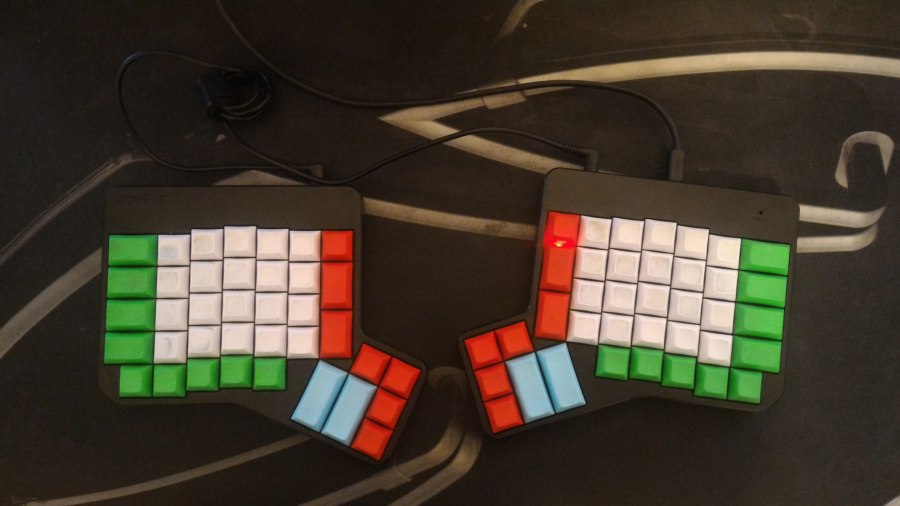

# Keyboards
My Keyboard configurations.


- **[Ergodox](#ergodox)**
<br/>

- **[History](./HISTORY.md)**
- **[Other settings](#other-settings)**


## Ergodox

- [General information](#ergodox-general-information)
- [OS layout](#ergodox-os-layout)
  - [Installation](#ergodox-os-layout-installation)
- [Physical layout](#ergodox-physical-layout)
- [Layout editors](#ergodox-layout-editors)
- [Flashing a layout](#ergodox-flashing-a-layout)
- [Hardware](#ergodox-hardware)
- [Known issues](#ergodox-known-issues)

<a id="ergodox-general-information"></a>
### General information
- [https://deskthority.net/wiki/ErgoDox](https://deskthority.net/wiki/ErgoDox)
- [https://www.ergodox.io/](https://www.ergodox.io/)

<a id="ergodox-os-layout"></a>
### OS layout

- qwertyfr : [http://marin.jb.free.fr/qwerty-fr/](http://marin.jb.free.fr/qwerty-fr/)

On Linux: for some programs to work correctly, after installation, do:
```
sudo mv /usr/share/X11/xkb/symbols/us_qwerty-fr /usr/share/X11/xkb/symbols/us_qwerty_fr
```
And use the `setxkbmap us_qwerty_fr` everywhere.

<a id="ergodox-os-layout-installation"></a>
#### Installation

(Mirror from the qwerty-fr site)

- .deb packages based Linux
    - dpkg -i [.deb](./static/xkb-qwerty-fr_0.5_all.deb)
    - select Layout "English (US)" with variant "French (qwerty-fr; US with french symbols)"
- [Arch Linux](https://aur.archlinux.org/packages/xkb-qwerty-fr/)
- Mac OS
    - Download [tgz archive](./static/qwerty-fr_mac.tgz)
    - extract qwerty-fr.bundle to:
        - /Library/Keyboard Layouts/ to install for all users
        - ~/Library/Keyboard Layouts/ for user-local installation
- Windows
    - Download [zip archive](./static/win-qwerty-fr.zip)
    - extract files and run setup.exe
    - For default input language select "French (France) - French qwerty keyboard"

In case of other Linux distribution or installation issue, you can refer to [manual installation](http://marin.jb.free.fr/qwerty-fr/manual/) page for Linux.

<a id="ergodox-physical-layout"></a>
### Physical layout
- [.hex file](./layout_2026-01-11.hex) | [configurator permalink](https://configure.zsa.io/ergodox-ez/layouts/5JNPY/latest/0)
- [source](./layout_2026-01-11_source)

layer0:


layer1:


<a id="ergodox-layout-editors"></a>
### Layout editors
- Ergodox layout configurators :
  - Ergodox EZ : [https://configure.ergodox-ez.com](https://configure.ergodox-ez.com)
  - Massdrop : [https://www.massdrop.com/configurator/ergodox](https://www.massdrop.com/configurator/ergodox)

<a id="ergodox-flashing-a-layout"></a>
### Flashing a layout
- Create the layout and download the .hex file
- Use the Keymapp flashing tool (https://github.com/zsa/wally/wiki/Linux-install):
  - Launch Keymapp and flash the downloaded .hex layout file to the keyboard

<a id="ergodox-hardware"></a>
### Hardware
#### keyboard 1
- Fully assembled cherry MX Brown switches Ergodox from fengsbay on ebay.
- Keycaps from https://pimpmykeyboard.com



#### keyboard 2
- ErgoDox EZ (cherry MX Brown) [https://ergodox-ez.com](https://ergodox-ez.com)
- Keycaps from https://pimpmykeyboard.com


<a id="ergodox-known-issues"></a>
### Known issues
- Windows 7
  - Key Chattering : [https://deskthority.net/wiki/Chatter](https://deskthority.net/wiki/Chatter)
    - [Fix](./issues/win7_key_chattering)

## Other settings
- [Xfce settings](./static/Xfce_settings.png)