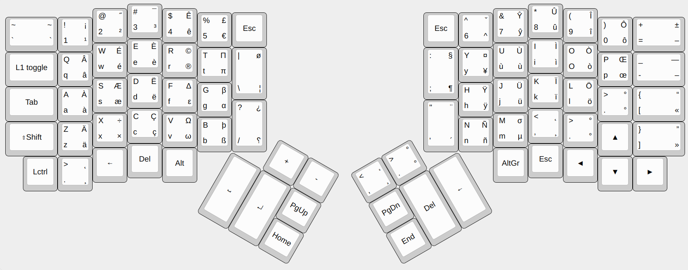
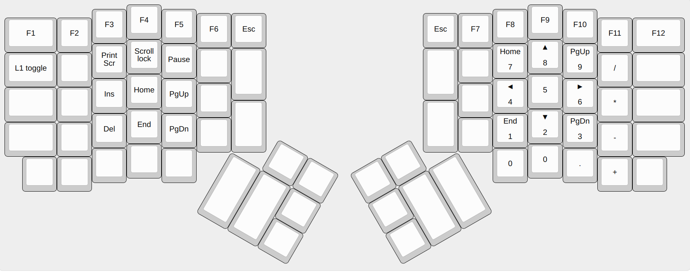

# Keyboards
The keyboards I use.


- [Ergodox](#ergodox) : [https://deskthority.net/wiki/ErgoDox](https://deskthority.net/wiki/ErgoDox)
  - [OS Layout](#ergodox-os-layout)
    - [Installation](#ergodox-os-layout-installation)
  - [Physical Layout](#ergodox-physical-layout)
  - [Layout editors](#ergodox-layout-editors)
  - [Flashing a layout](#ergodox-flashing-a-layout)
  - [Hardware](#ergodox-hardware)
  - [Known issues](#ergodox-known-issues)


## Ergodox

### OS layout <a id="ergodox-os-layout"></a>

qwertyfr : [http://marin.jb.free.fr/qwerty-fr/](http://marin.jb.free.fr/qwerty-fr/)

#### Installation <a id="ergodox-os-layout-installation"></a>

(Mirror from the qwerty-fr site)

- .deb packages based Linux
	- dpkg -i [.deb](./static/xkb-qwerty-fr_0.5_all.deb)
	- select Layout "English (US)" with variant "French (qwerty-fr; US with french symbols)"
- [Arch Linux](https://aur.archlinux.org/packages/xkb-qwerty-fr/)
- Mac OS
	- Download [tgz archive](./static/qwerty-fr_mac.tgz) 
	- extract qwerty-fr.bundle to:
		- /Library/Keyboard Layouts/ to install for all users
		- ~/Library/Keyboard Layouts/ for user-local installation
- Windows
	- Download [zip archive](./static/win-qwerty-fr.zip)
	- extract files and run setup.exe
	- For default input language select "French (France) - French qwerty keyboard"

In case of other Linux distribution or installation issue, you can refer to [manual installation](http://marin.jb.free.fr/qwerty-fr/manual/) page for Linux.

### Physical layout <a id="ergodox-physical-layout"></a>
Currently using only 2 layers :

layer0:


layer1:


- [.hex file](./layout_01.03.2018.hex)
- [source](./layout_01.03.2018)

### Layout editors <a id="ergodox-layout-editors"></a>
- Ergodox Layout Configurator : [https://www.massdrop.com/configurator/ergodox](https://www.massdrop.com/configurator/ergodox)

- Visual Layout Editor : [http://www.keyboard-layout-editor.com/](http://www.keyboard-layout-editor.com/)


### Flashing a layout <a id="ergodox-flashing-a-layout"></a>
- Using the teensy loader cli: 
 - [Official website](https://www.pjrc.com/teensy/loader_cli.html)
 - [Github](https://github.com/PaulStoffregen/teensy_loader_cli)

(The command I use for the teensy board I have)
```teensy_loader_cli -mmcu=atmega32u4 -w -v layout.hex```


### Hardware <a id="ergodox-hardware"></a>
- Fully assembled MX-Brown switches Ergodox from fengsbay on ebay.
- Keycaps from https://pimpmykeyboard.com


### Known issues <a id="ergodox-known-issues"></a>
- Windows 7
  - Key Chattering : [https://deskthority.net/wiki/Chatter](https://deskthority.net/wiki/Chatter)
    - [Fix](./issues/win7_key_chattering)